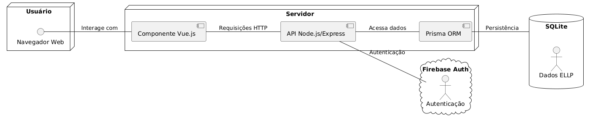

# ELLP - Sistema de Registro de Presença

## 📜 Descrição

Este projeto visa desenvolver um sistema web para o registro de presença nas oficinas do projeto de extensão ELLP (Ensino Lúdico de Lógica e Programação) da UTFPR. O sistema permitirá o cadastro de oficinas e alunos, o registro eficiente da presença e a geração de relatórios de frequência, otimizando a gestão das atividades do projeto.

## ⚙️ Funcionalidades Principais

- **Cadastro de Oficinas:** Permite o cadastro detalhado de novas oficinas (nome, descrição, data, horário, responsáveis).
- **Cadastro de Alunos:** Permite o cadastro de alunos participantes (nome, idade, escola, contato, associação à(s) oficina(s)).
- **Registro de Presença:** Permite o registro rápido e seguro da presença dos alunos em cada oficina.
- **Consulta de Presença:** Permite a consulta das presenças registradas, com filtros por aluno, oficina e período.

## 📝 Requisitos Funcionais

| **ID**  | **Requisito Funcional**                                         | **Descrição**                                                                                                                                      |
|---------|------------------------------------------------------------------|----------------------------------------------------------------------------------------------------------------------------------------------------|
| **RF1** | Cadastro de Oficinas                                            | O sistema deve permitir o cadastro de novas oficinas, incluindo nome, descrição, data, horário e responsáveis.                                      |
| **RF2** | Cadastro de Alunos                                              | O sistema deve permitir o cadastro de alunos participantes, com dados como nome, RA e associação à(s) oficina(s).              |
| **RF3** | Registro de Presença                                             | O sistema deve permitir o registro da presença dos alunos em cada oficina realizada, de forma rápida e segura.                                     |
| **RF4** | Consulta de Presença                                            | O sistema deve permitir a consulta das presenças registradas, filtrando por aluno, oficina e período.                                                |
| **RF5** | Edição e Exclusão de Registros                                   | O sistema deve permitir a edição e exclusão de cadastros de oficinas, alunos e presenças, respeitando restrições de integridade.                    |
| **RF6** | Visualização de Dados                                           | O sistema deve permitir que administradores visualizem listas de oficinas, alunos e presenças de forma organizada.                                   |

## 🗃️ Arquitetura

O sistema será desenvolvido utilizando a seguinte arquitetura:

- **Frontend:** Vue.js (interface do usuário)
- **Backend:** Node.js com Express.js (lógica da aplicação e API)
- **Banco de Dados:** PostgreSQL com Prisma ORM (armazenamento dos dados)

## 📊 Diagrama de Arquitetura

## 🧰 Tecnologias Utilizadas

- Vue.js
- Node.js
- Express.js
- PostgreSQL
- Prisma ORM
- Firebase Auth
- Git
- GitHub

## 🏅 Metodologia

O desenvolvimento do projeto seguirá a metodologia Scrum, com sprints focados na entrega iterativa de funcionalidades. A gestão de tarefas será realizada através de um Kanban.

## ⚠️ Observações

Alguns possíveis erros possuem correções no README do front ou back, dependendo do erro.

## 🚀 Próximos Passos

1.  Definição detalhada dos requisitos funcionais.
2.  Implementação da estrutura inicial do backend com Node.js e Express.js.
3.  Criação dos modelos de dados com Prisma ORM para o banco de dados PostgreSQL.

## 🤝 Colaboradores

<table>
  <tr>
    <td align="center">
      <a href="https://github.com/Kio-Suzuki">
         
        
          <b>Akio Suzuki</b>
        
      </a>
    </td>
    <td align="center">
      <a href="https://github.com/pedrohcmoda">
         
        
          <b>Pedro Moda</b>
        
      </a>
    </td>
    <td align="center">
      <a href="https://github.com/kauanbrt">
         
        
          <b>Kauan Borotto</b>
        
      </a>
    </td>
  </tr>
</table>
